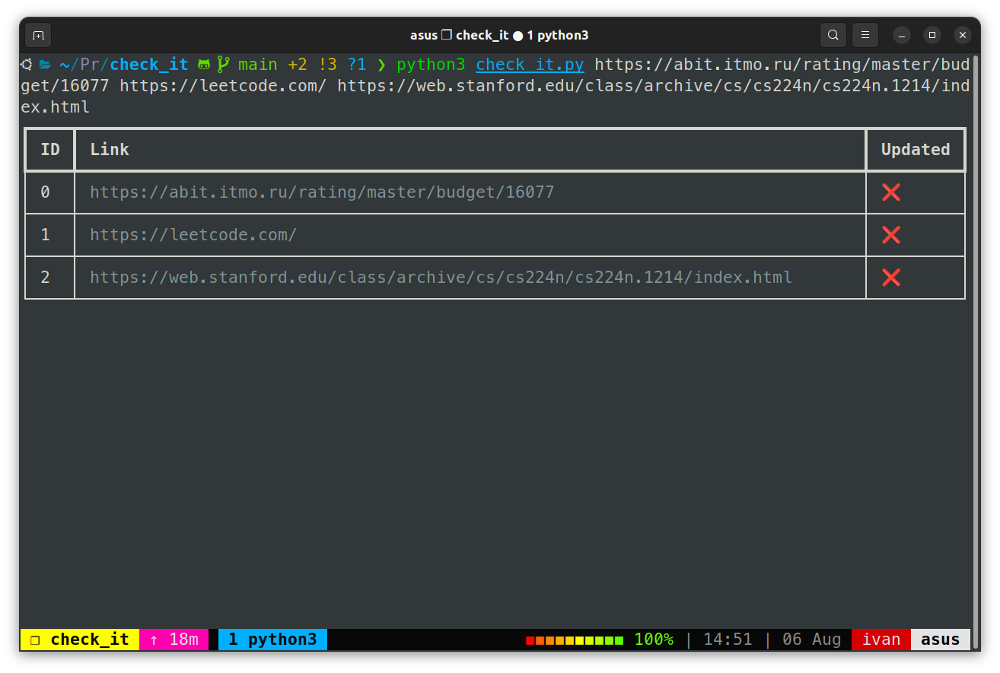

# Check updates of websites with `check_it` :sparkles:
Python script which will check update of websites for you.


## Installation
```shell
git clone https://github.com/tikerlade/check_it.git
cd check_it
pip install -r requirements.txt
```

## Usage
```shell
python3 check_it.py https://abit.itmo.ru/rating/master/budget/16077 https://leetcode.com/ https://web.stanford.edu/class/archive/cs/cs224n/cs224n.1214/index.html
```
